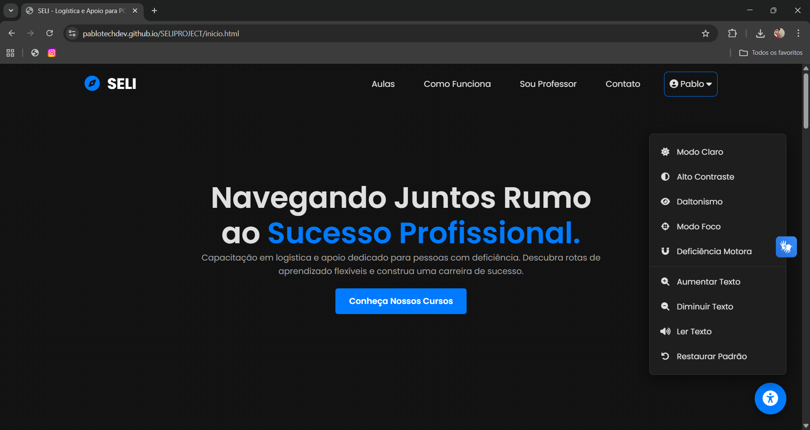

# 📦 SELI - Sistema de Ensino Logístico Inclusivo


> "A logística move o mundo, a inclusão move as pessoas."

---

## 💻 Sobre o Projeto

A **SELI** nasceu da união de dois mundos: a precisão da logística e a necessidade urgente de inclusão social. Somos uma plataforma EAD (Ensino a Distância) projetada para oferecer cursos de alta qualidade na área de logística, **nativamente adaptada para Pessoas com Deficiência (PCDs)**.

Diferente de plataformas tradicionais que "adaptam" o conteúdo depois, a SELI foi desenhada com o conceito de **Accessibility First**. Nossa metodologia permite que cada aluno trace sua própria rota de conhecimento, respeitando seu ritmo e suas necessidades de navegação.

---

## 🎨 Layout e Telas

Abaixo, algumas demonstrações da interface focada em UX e Acessibilidade:

### 🏠 Tela Inicial (Landing Page)

*Design limpo com alto contraste e navegação simplificada.*

### 📚 Área de Estudo(Mentor)

*Interface focada no conteúdo, sem distrações visuais.*

### 📚 Área de Estudo(Mentor)

*Interface focada em organização e edição livre centrada para os professores/mentores*

---

## 🛠 Tecnologias Utilizadas

O projeto foi desenvolvido focando em performance, compatibilidade e, acima de tudo, acessibilidade semântica.

- **HTML5 Semântico:** Estruturação correta para leitores de tela.
- **CSS3:** Flexbox e Grid Layout para responsividade total + Variáveis para temas de alto contraste.
- **JavaScript (ES6+):** Manipulação do DOM para interatividade e controle de fluxo do usuário.
- **Figma:** Prototipagem de interfaces e fluxo de usuário (UI/UX).
- **Git & GitHub:** Versionamento de código.

---

## ♿ Funcionalidades de Acessibilidade (Destaques)

- [x] **Navegação por Teclado:** Todo o site é operável sem mouse.
- [x] **Contraste Aprimorado:** Cores pensadas para daltônicos e baixa visão.
- [x] **Semântica WAI-ARIA:** Labels e descrições para leitores de tela (Screen Readers).
- [x] **Layout Responsivo:** Adapta-se a qualquer dispositivo (Mobile First).

---

## 🚀 Como acessar

Você pode acessar a versão online do projeto através do link abaixo:

🔗 **[Acessar Projeto SELI](https://pablouweb.github.io/SELIPROJECT/inicio.html)**

---

## 📂 Como rodar o projeto localmente

1. Clone o repositório:
```bash
git clone [https://github.com/PabloTechDev/SELIPROJECT.git](https://github.com/PabloTechDev/SELIPROJECT.git)
